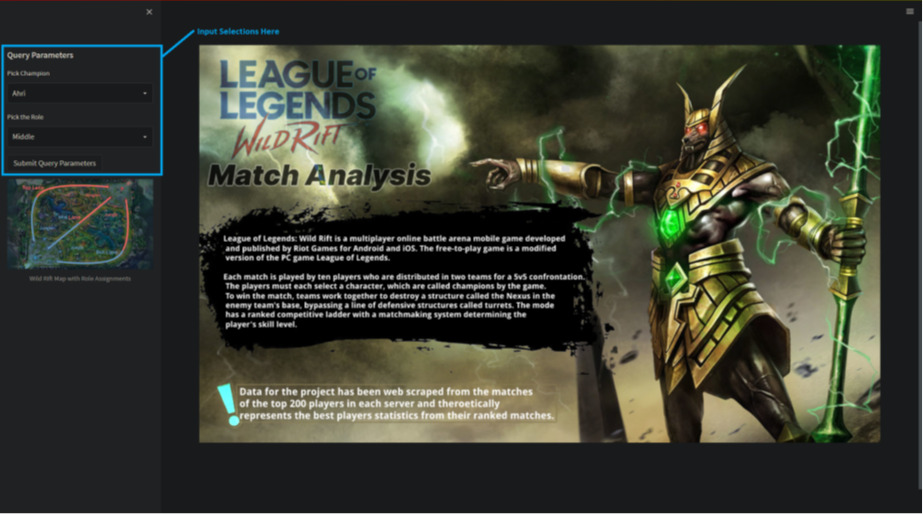
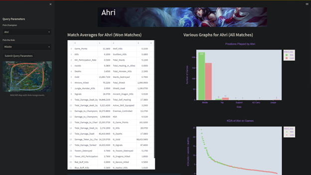

# League of Legends: Wild Rift Comprehensive Player Performance Analysis
#### Robert Conner 
 https://www.linkedin.com/in/robert-conner8/

 https://www.RobertjConner.com/
# Description:
This project introduces a dynamic and interactive platform for League of Legends: Wild Rift players, aimed at game strategy analysis and performance improvement. By allowing users to input the URL to their match database from a match statistics website, the dashboard employs sophisticated data scraping techniques to harvest comprehensive match data. It analyzes a wide array of performance metrics to predict match outcomes and identify pivotal performance indicators. This dashboard not only automates the process of data wrangling but also provides a user-friendly interface for players to access personalized match analyses, thereby offering strategic insights and tailored feedback to enhance individual gameplay proficiency.



)

# Installation Instructions
This project is developed using PyCharm and leverages Streamlit for creating an interactive web dashboard. Follow these steps to set up your environment and run the application.

# Prerequisites
- Python 3.x installed on your computer.
- PyCharm IDE (Community or Professional Edition) for an enhanced development experience.
- Internet access for performing web scraping and accessing match data.
# Setting Up Your Environment
- Clone the Repository: Clone the project repository to your local machine by running the following command in your terminal:

```git clone https://github.com/robert-conner/WildRift-Match-Analysis```

- Open the Project in PyCharm: Start PyCharm and open the cloned project directory by selecting "Open" from the File menu.

# Create a Virtual Environment:

- In PyCharm, navigate to File > Settings > Project: <Your-Project-Name> > Python Interpreter.
- Click on the gear icon, select 'Add', and then 'Virtualenv Environment'. Ensure the 'Base interpreter' is set to your Python 3.x installation.
- Click 'OK' to create the virtual environment.
# Install Required Packages:

- Activate the virtual environment by using the terminal in PyCharm:
```
source venv/bin/activate  # On Unix/macOS
.\venv\Scripts\activate    # On Windows
```

- Install the necessary Python packages including Streamlit for the dashboard, beautifulsoup4 and requests for web scraping, and others as needed by the project:
- 
```
pip install -r requirements.txt
```

- Ensure requirements.txt includes streamlit and any other dependencies.
# Running the Streamlit Application:

- Navigate to the directory containing the Streamlit app script (usually app.py or a similarly named file).
- Launch the Streamlit dashboard by running:
- 
```
streamlit run app.py
```

- Streamlit will automatically open the dashboard in your default web browser, typically at http://localhost:8501.

# Note:
The project was designed to interact with a match statistics website for data scraping. The website providing those statistics has since been discontinued and the dashboard will no longer work correctly as coded.

# 
# Features and Benefits
- Personalized Performance Insights: The dashboard provides a unique, in-depth analysis of individual player performance by allowing users to input the URL to their match database. This functionality enables the scraping and analysis of match data to deliver personalized insights.

- Comprehensive Data Analysis: Utilizing a dataset compiled from top player matches, the project applies sophisticated data wrangling techniques to predict match outcomes and identify key performance indicators that influence winning conditions.

- Interactive Dashboard Experience: Built with Streamlit, the dashboard offers an interactive platform for users to explore their performance metrics. This user-friendly interface makes it easy to visualize data through various charts and tables, tailored to individual user queries.

- Strategic Improvement Recommendations: By analyzing performance data, the dashboard highlights areas for improvement, offering players actionable insights to enhance their gameplay strategy and increase their chances of winning.

- Technological Innovation: Leveraging advanced web scraping techniques and the latest in data analysis methodologies, the project showcases the potential of Python and Streamlit in creating data-driven applications for the gaming community.

# Technical Details
- Data Collection and Wrangling: The project employs Python scripts to scrape match data from a designated statistics website, followed by extensive data cleansing and preparation to ensure accuracy and relevance of the analyzed information.

- Predictive Modeling: Utilizing regression and classification models, including LASSO (Least Absolute Shrinkage and Selection Operator) for feature selection and a Random Forest model for prediction, the project identifies significant statistics and predicts match outcomes based on player performance data.

- Streamlit Dashboard: The interactive dashboard is developed using Streamlit, a powerful Python library for creating web applications. It allows for dynamic data visualization and user interaction without the need for complex web development skills.

- Role-Specific Analysis: The project includes a detailed examination of player performance across different roles within the game, providing role-specific insights and recommendations to help players optimize their strategies.

- Deployment and Accessibility: The application is designed to be easily deployable and accessible, requiring only a Python environment and internet access to run. This ensures that players from various technical backgrounds can benefit from the insights provided.

# Future Enhancements
- I hope to revisit this project in the future and make use of both better machine learning algorithms as well as redesign how I approach feature engineering and model design. There are multiple improvements that can be made in the future.

